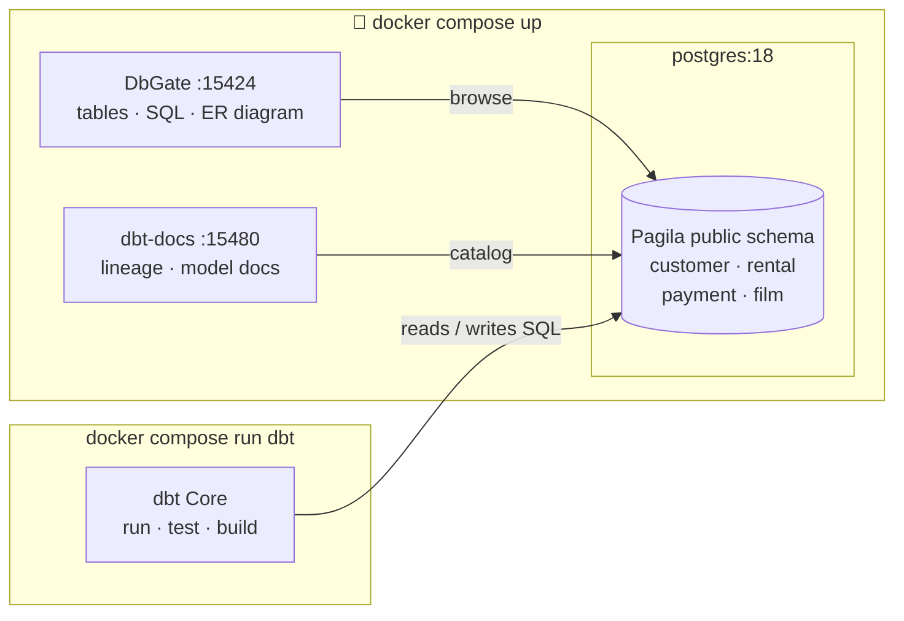
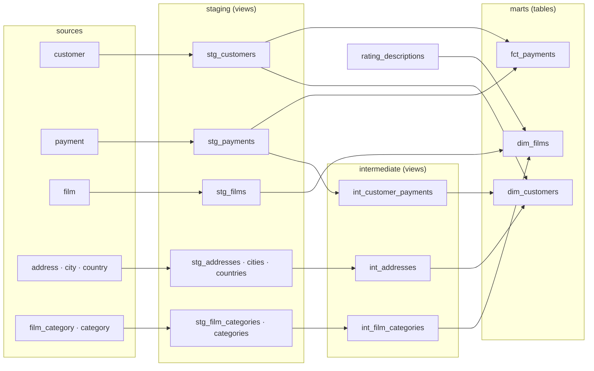

# dbt Core: The Brutalist Blueprint


A fully-runnable dbt project for a beginner data-engineering class, on real
public data: **[Pagila](https://github.com/devrimgunduz/pagila)** — the standard
Postgres sample database (a DVD-rental store, ~51k payments & rentals).
**Both Postgres and dbt Core run in Docker** — no local Python required.
Every step here maps to a **▶ LAB CHECKPOINT** in the slides.

> 📊 **Slides:** https://thosangs.github.io/dbt_lecture/  ·  brutalist × teal, diagram-driven

### The stack



### The model DAG (what dbt builds)



## The containers

| Service | What it is | URL |
|---|---|---|
| `postgres` | The warehouse (Postgres 18). Pagila is auto-loaded into `public` on first boot. | `localhost:15432` |
| `dbgate` | [DbGate](https://github.com/dbgate/dbgate) — a modern browser UI: data grid with per-column filters, SQL editor, ER diagrams. Opens **straight to a pre-defined `Pagila` connection (no login)**, and shows the partitioned `payment` table as **one** (51k rows). | http://localhost:15424 |
| `dbt-docs` | dbt docs site — model descriptions, column metadata, interactive lineage graph. Regenerates on container start. | http://localhost:15480 |
| `dbt` | dbt Core CLI for labs. Invoked on demand with `docker compose run` (profile `dbt`; not started by plain `up`). | — |

## 0. Bring up the stack

```bash
docker compose up -d          # postgres + dbgate + dbt-docs

# Browse the raw Pagila data — opens straight to the "Pagila" connection, no login:
open http://localhost:15424

# dbt docs / lineage (after models are built, restart to refresh):
open http://localhost:15480

# drop into the dbt container — every dbt command runs in here:
docker compose run --rm dbt bash
```

You are now inside the dbt container when you `run bash`. Run the labs below from that shell.
(One-off without a shell: `docker compose run --rm dbt dbt debug`.)

After changing models or YAML docs, refresh the docs site:

```bash
docker compose restart dbt-docs
```

## 1. Module 02 — connect & first run

```bash
dbt debug                        # expect: "All checks passed!"
dbt run --select my_first_model
```

## 2. Module 03 — seeds, sources, layers & materializations

```bash
dbt seed                                       # load rating_descriptions.csv
dbt run --select staging                       # stg_* views (1:1 with sources)
dbt run --select intermediate                  # int_* views (joins & rollups)
dbt run --select dim_customers dim_films       # dimension tables
dbt run --select fct_payments                  # incremental: full build (~51k rows)
dbt run --select fct_payments                  # incremental: delta only (INSERT 0 0)
```

## 3. Module 04 — dynamic SQL (macro, hooks, vars)

```bash
dbt run --select stg_customers                 # uses the full_name() macro
dbt run --select dim_customers                 # +post-hook grants to "reporter"
dbt run --select fct_payments --vars '{"start_date": "2022-04-01"}'
```

## 4. Module 05 — trust: tests, history, docs

```bash
dbt test                          # generic + singular tests
dbt snapshot                      # SCD Type 2 history of customer.last_update
dbt build --select +fct_payments  # run + test the model and everything upstream
docker compose restart dbt-docs   # regenerate + serve at http://localhost:15480
```

## Peek at the results (from your host, another terminal)

```bash
docker exec -it dbt_class_pg psql -U dbt -d analytics \
  -c "select * from dev.dim_customers order by lifetime_value desc limit 10;"
```

## Project layout

```
docker-compose.yml     postgres + dbgate + dbt-docs + dbt (on-demand)
docker/init/           01_setup.sql + Pagila dump -> loaded into public (dbt SOURCES)
docker/dbt/Dockerfile  the dbt Core + Postgres adapter image
dbt_project.yml        project config (paths, vars, post-hook, materializations)
profiles.yml           connection; host is env-driven (container vs local)
seeds/                 rating_descriptions.csv (a tiny static lookup)
models/
  example/             my_first_model.sql  (hello world, table)
  staging/             stg_* views (1:1 with Pagila sources)
  intermediate/        int_* views (joins & rollups between staging and marts)
  marts/               dim_customers, dim_films (tables), fct_payments (incremental)
macros/                full_name.sql
snapshots/             customers_snapshot.sql (SCD Type 2 on last_update)
tests/                 assert_fct_payments_amount_positive.sql (singular test)
slides/                the lecture deck (Slidev)
assignment/            student assignment sub-project (Pagila) — no setup needed
sandbox/               scratch space for the `dbt init` demo (git-ignored)
```

## Student assignment

A graded, end-to-end assignment (staging → intermediate → mart → snapshot → test)
built on this same Pagila data lives in **[`assignment/`](assignment/)** — its own
dbt sub-project that runs in the same container and writes to an isolated
`dev_assignment` schema, so students just start:

```bash
docker compose run --rm dbt bash
cd assignment && dbt debug
```

## Demo: `dbt init` (how a dbt project is born)

This repo is already scaffolded, but to *show* how `dbt init` bootstraps a brand-new
project, run it in the throwaway **`sandbox/`** folder. `sandbox/` is bind-mounted
into the dbt container at **`/sandbox`** (a path *outside* `/usr/app`, so `dbt init`
doesn't detect the parent project and refuse to scaffold) and is git-ignored, so
the real `dbt_project.yml` / `profiles.yml` are never touched.

```bash
docker compose run --rm dbt bash
cd /sandbox                          # ↔ host ./sandbox — mounted, visible in your editor, git-ignored
export DBT_PROFILES_DIR=/sandbox     # the wizard writes its profile HERE, not the real one
dbt init demo_shop                   # full interactive wizard
```

- The `export` is scoped to that shell; a fresh `docker compose run` resets
  `DBT_PROFILES_DIR` back to `/usr/app`. Or just `cd /usr/app` to keep working on the project.
- To point the wizard at the running Pagila DB, enter: host `postgres`, port `5432`,
  user `dbt`, password `dbt`, dbname `analytics`, schema `demo`.
- Just the folder tree, no wizard / no profile: `dbt init demo_shop --skip-profile-setup`.

## Reset / teardown

```bash
docker compose down             # stop everything (keeps data volume)
docker compose down -v          # stop + wipe data (fresh raw layer next boot)
```

## Optional: run dbt on your host instead of in Docker

`profiles.yml` reads `DBT_HOST` (defaults to `localhost`), so a host install works too:

```bash
uv venv --python 3.11 && uv pip install -r requirements.txt
source .venv/bin/activate
export DBT_PROFILES_DIR=$(pwd)
docker compose up -d postgres   # just the DB
dbt debug
```
